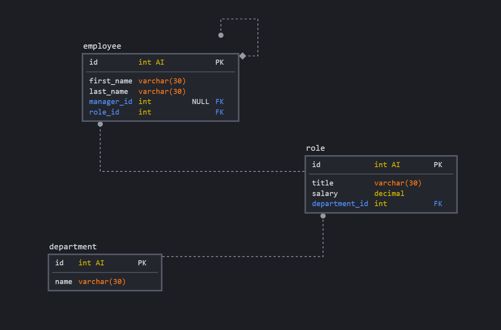

# Employee Tracker

From a humble tech startup to a global billion-dollar empire, you've done pretty well for yourself. You've also amassed quite a few employees... how do you keep track of them all?! 

With an Employee Tracker, naturally.

This repo demonstrates a basic MySQL database with the ability to store and remove employees and search by such things as department or role.

It's based on the following schema:

## Issues I had

Mainly how to deal with the asynchronous nature of the SQL queries. I would try to retrieve data from the DB and use it in a function, but the function was being called before the query could complete, and hence would try to access data that didn't exist yet. 

I attempted to use the mysql2 package which offers native support for promises and async/await functionality, but didn't have much success. I need to brush up on my knowledge.

Another problem I faced related to assigning the FK for the employee table.

As shown in the schema, the manager_id references the primary id key in the employee table, and when I tried to seed the table it would throw an error because I was referencing IDs which didn't exist. I tried to seed the manager_id separately to avoid this issue, which caused an error because the other columns weren't assigned default values. Oh well.

## How to use it

Should for some reason you want to use it, simply clone this repo and in the terminal run npm install followed by npm start. 

## Video demonstration 

